# Category I: Systematic Review Automation

<Callout type="info">
**New in Diverga v6.5**: Category I agents integrate with ScholaRAG for automated PRISMA 2020 systematic literature reviews.
</Callout>

## Overview

Category I provides 4 specialized agents for automating systematic literature reviews following PRISMA 2020 guidelines. These agents integrate with ScholaRAG to provide:

- **Multi-database paper retrieval** (Semantic Scholar, OpenAlex, arXiv)
- **AI-assisted PRISMA screening** (using Groq LLM - 100x cost reduction)
- **Automatic deduplication** by DOI and title similarity
- **RAG system construction** for literature synthesis
- **PRISMA flow diagram generation**

## Agent Registry

| ID | Agent | Model | Checkpoint |
|----|-------|-------|------------|
| **I0** | Scholar Agent Orchestrator | Opus | 🟡 SCH_PRISMA_GENERATION |
| **I1** | Paper Retrieval Agent | Sonnet | 🔴 SCH_DATABASE_SELECTION |
| **I2** | Screening Assistant | Sonnet | 🔴 SCH_SCREENING_CRITERIA |
| **I3** | RAG Builder | Haiku | 🟠 SCH_RAG_READINESS |

---

## I0: Scholar Agent Orchestrator 🎼

<AgentCard
  id="I0"
  name="Scholar Agent Orchestrator"
  tier="HIGH"
  model="opus"
  checkpoint="SCH_PRISMA_GENERATION"
/>

### Purpose

Orchestrates the complete ScholaRAG 7-stage PRISMA systematic review pipeline, coordinating I1→I2→I3 agents and managing human checkpoints.

### Trigger Keywords

```
systematic review, literature review automation, ScholaRAG, PRISMA pipeline
체계적 문헌고찰, 문헌고찰 자동화, PRISMA 파이프라인
```

### Workflow

```mermaid
graph TD
    A[I0 Orchestrator] --> B[🔴 SCH_DATABASE_SELECTION]
    B --> C[I1 Paper Retrieval]
    C --> D[🔴 SCH_SCREENING_CRITERIA]
    D --> E[I2 Screening]
    E --> F[🟠 SCH_RAG_READINESS]
    F --> G[I3 RAG Builder]
    G --> H[🟡 SCH_PRISMA_GENERATION]
```



### ScholaRAG Scripts Coordinated

| Stage | Script | Purpose |
|-------|--------|---------|
| 1 | `scholarag_cli.py init` | Initialize project |
| 2 | `01_fetch_papers.py` | Retrieve papers |
| 3 | `02_deduplicate.py` | Remove duplicates |
| 4 | `03_screen_papers.py` | PRISMA screening |
| 5 | `04_download_pdfs.py` | Download PDFs |
| 6 | `05_build_rag.py` | Build vector DB |
| 7 | `07_generate_prisma.py` | Generate diagram |

---

## I1: Paper Retrieval Agent 📥

<AgentCard
  id="I1"
  name="Paper Retrieval Agent"
  tier="MEDIUM"
  model="sonnet"
  checkpoint="SCH_DATABASE_SELECTION"
/>

### Purpose

Retrieves papers from multiple open access databases with automatic deduplication by DOI and title similarity.

### Trigger Keywords

```
fetch papers, retrieve papers, database search, Semantic Scholar, OpenAlex, arXiv
논문 검색, 논문 수집, 데이터베이스 검색
```

### Supported Databases

| Database | Open Access Rate | PDF Availability | API Key Required |
|----------|------------------|------------------|------------------|
| Semantic Scholar | ~40% | Direct PDF URLs | Optional (higher limits) |
| OpenAlex | ~50% | OA PDF URLs | No |
| arXiv | 100% | All PDFs | No |
| Scopus | N/A | Metadata only | Yes (institutional) |
| Web of Science | N/A | Metadata only | Yes (institutional) |

### Deduplication Strategy

1. **DOI Matching**: Exact DOI comparison
2. **Title Similarity**: >85% Jaccard similarity threshold
3. **Author + Year**: Fallback for papers without DOI

### Output Files

```
data/01_raw/
├── semantic_scholar_results.csv
├── openalex_results.csv
├── arxiv_results.csv
└── deduplicated.csv
```

---

## I2: Screening Assistant 🔬

<AgentCard
  id="I2"
  name="Screening Assistant"
  tier="MEDIUM"
  model="sonnet"
  checkpoint="SCH_SCREENING_CRITERIA"
/>

### Purpose

AI-assisted PRISMA 6-dimension screening using Groq LLM for cost-efficient large-scale paper filtering.

### Trigger Keywords

```
screen papers, PRISMA screening, inclusion criteria, exclusion criteria
논문 스크리닝, PRISMA 스크리닝, 포함 기준, 제외 기준
```

### Screening Dimensions

| Dimension | Description |
|-----------|-------------|
| 1. Topic Relevance | Does the paper address the research topic? |
| 2. Population | Does it study the target population? |
| 3. Intervention | Does it involve the target intervention? |
| 4. Outcome | Does it measure relevant outcomes? |
| 5. Study Design | Is it empirical research? |
| 6. Language | Is it in English? |

### Project Type Thresholds

| Mode | Threshold | Expected Papers | Use Case |
|------|-----------|-----------------|----------|
| `knowledge_repository` | 50% | 5,000-15,000 | AI research assistant, teaching |
| `systematic_review` | 90% | 50-300 | Meta-analysis, publication |

### LLM Provider Options

| Provider | Model | Cost per 100 Papers |
|----------|-------|---------------------|
| **Groq** (default) | llama-3.3-70b-versatile | $0.01 |
| Claude | claude-haiku-4-5 | $0.15 |
| Ollama | Local models | $0 |

### Output Files

```
data/02_screening/
├── relevant_papers.csv
├── excluded_papers.csv
└── screening_log.json
```

---

## I3: RAG Builder 🧱

<AgentCard
  id="I3"
  name="RAG Builder"
  tier="LOW"
  model="haiku"
  checkpoint="SCH_RAG_READINESS"
/>

### Purpose

Builds ChromaDB vector database with local embeddings for zero-cost literature synthesis queries.

### Trigger Keywords

```
build RAG, vector database, ChromaDB, PDF embeddings, literature synthesis
RAG 구축, 벡터 데이터베이스, ChromaDB, PDF 임베딩
```

### Zero-Cost Stack

| Component | Technology | Cost |
|-----------|------------|------|
| Embeddings | all-MiniLM-L6-v2 | $0 (local) |
| Vector DB | ChromaDB | $0 (local) |
| PDF Processing | PyMuPDF | $0 |
| Chunking | Token-based (500 tokens) | $0 |

### PDF Download Sources

Priority order:
1. arXiv (direct PDF URLs)
2. OpenAlex OA URLs
3. Semantic Scholar OA URLs
4. Unpaywall fallback

### Output Files

```
data/03_pdfs/
├── *.pdf (downloaded papers)
└── download_log.json

data/04_rag/
├── chroma_db/ (vector database)
└── rag_config.json
```

---

## Checkpoints

### 🔴 SCH_DATABASE_SELECTION (Required)

**Level**: REQUIRED
**Agent**: I1
**When**: Before paper retrieval begins

**User Decision**: Which databases to search
- Open Access Only (Semantic Scholar + OpenAlex + arXiv)
- Open Access + Scopus
- Full Coverage (all 5 databases)

### 🔴 SCH_SCREENING_CRITERIA (Required)

**Level**: REQUIRED
**Agent**: I2
**When**: Before PRISMA screening begins

**User Decision**: Project type selection
- `knowledge_repository` (50% threshold)
- `systematic_review` (90% threshold)

### 🟠 SCH_RAG_READINESS (Recommended)

**Level**: RECOMMENDED
**Agent**: I3
**When**: Before RAG building begins

**User Decision**: Confirm search strategy and proceed

### 🟡 SCH_PRISMA_GENERATION (Optional)

**Level**: OPTIONAL
**Agent**: I0
**When**: After RAG building complete

**User Decision**: Generate PRISMA flow diagram

---

## Usage Example

```
User: I want to conduct a PRISMA 2020 systematic review on AI in education.

Claude: [I0 activates]
        🔴 CHECKPOINT: SCH_DATABASE_SELECTION
        Which databases would you like to search?
        [A] Open Access Only
        [B] Open Access + Scopus
        [C] Full Coverage

User: A

Claude: [I1 activates - paper retrieval]
        ...
```

<Callout type="tip">
See [Systematic Review Workflow Example](/docs/examples/systematic-review-workflow) for a complete conversation transcript.
</Callout>

---

## Integration with Other Categories

Category I agents work together with other Diverga agents:

| Integration | Agents | Purpose |
|-------------|--------|---------|
| Research Design | A1, A2 | Refine research question |
| Literature | B1, B2 | Evidence quality appraisal |
| Meta-Analysis | C5, C6, C7 | Data extraction and analysis |
| Quality | F2 | PRISMA 2020 checklist compliance |

---

## Cost Summary

| Operation | Provider | Cost |
|-----------|----------|------|
| Paper Retrieval | Free APIs | $0 |
| PRISMA Screening (500 papers) | Groq | $0.05 |
| PDF Download | Free sources | $0 |
| RAG Embeddings | Local model | $0 |
| RAG Queries (50) | Groq | $0.02 |
| **Total** | - | **~$0.07** |

<Callout type="success">
Using Groq instead of Claude for screening reduces costs by **100x** (from ~$7.50 to ~$0.07).
</Callout>
